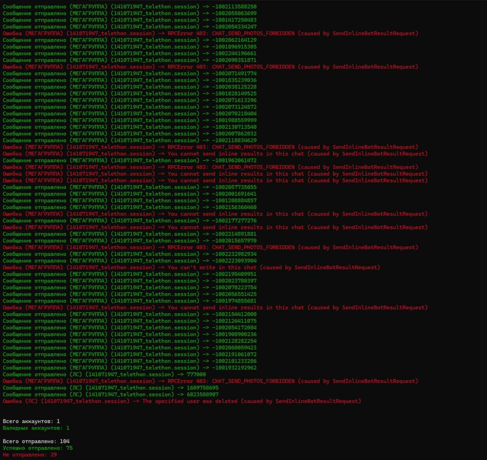

# @POSTBOT SPAMER


## Описание 

Асинхронный спамер сообщениями из @postbot [Поддержка картинок, кнопок и т.д.]

## Установка

1. Клонируйте репозиторий
   ```bash
   git clone https://github.com/kanapelkaa/spamer_postbot
2. Скачиватйе все зависимости
   ```bash
   pip install -r requirements.txt
3. Настройте config, укажите прокси в файл proxy.txt
4. Загрузите сессии в папку sessions
5. Запустите скрипт py main.py
   ```bash
   py main.py



# Проект создан для конкурса на форуме lolz.live
